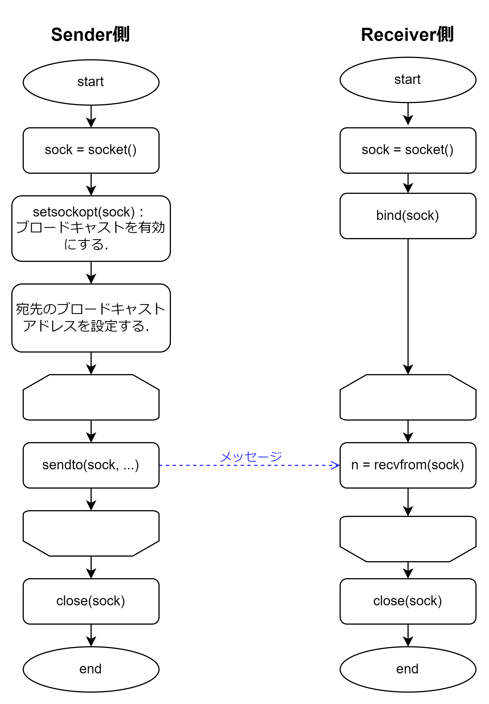

# Simple Broadcast

一定間隔で短いメッセージをブロードキャストする．

## 実行方法

#### 送信者：`./simple_broadcast-sender.out [ブロードキャストアドレス]`

引数でブロードキャストアドレスを指定する．
引数を指定しない場合は，ローカルネットワーク (255.255.255.255) へのブロードキャストとなる．

プロセスが停止されるまで繰り返し，3秒間隔で短いメッセージがブロードキャストされる．

#### 受信者：`./simple_broadcast-receiver.out`

プロセスが停止されるまで繰り返しメッセージを受信する．
